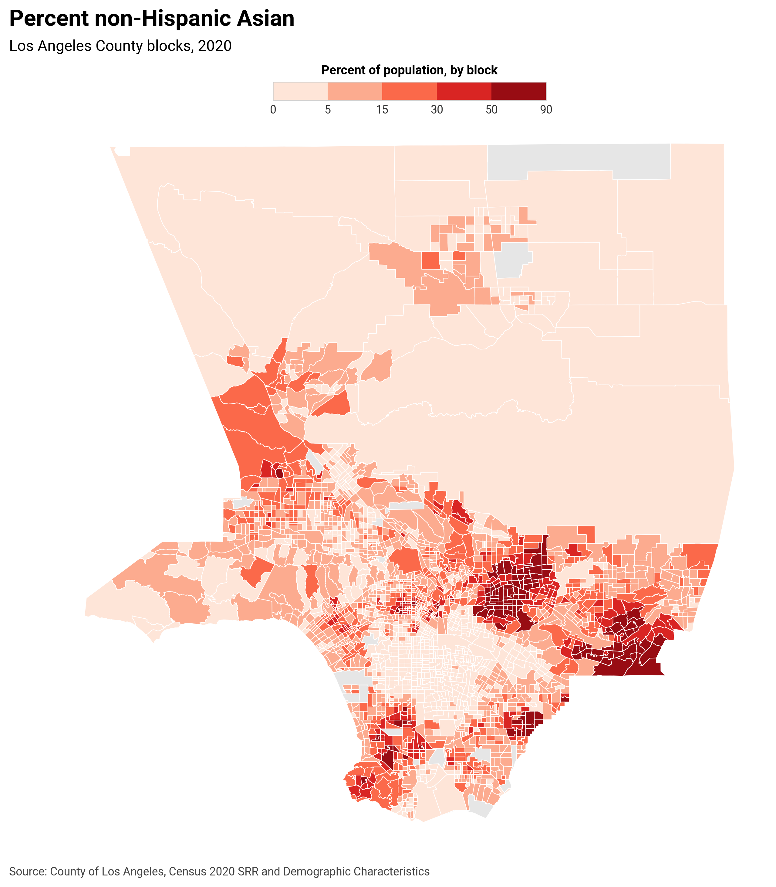

# Chorokit

Choropleth helper for GeoPandas with defaults for projection, layout and legend. 

*This project is in the early stages development. Contributions and feedback welcome.* 

## Core principles

- **Easy to use:** the common case works with one function call or CLI command
- **Defaults first, flexibility when needed:** well-designed defaults that you can override with small configs; explicit beats auto
- **Speed:** avoid unnecessary copies and Python loops; keep plotting fast for large GeoDataFrames
- **Clean, production ready outputs:** consistent spacing, legible labels, subtle legend; high DPI and tight bounding boxes
- **Predictable and reproducible:** deterministic classifications and colors when breaks are specified; versioned defaults
- **Accessible and readable:** offer color-vision-safe palettes and readable tick labels
- **Small surface area:** dataclasses capture configuration; CLI mirrors the Python API
- **Composable design:** separate modules for projection, legend and layout so parts can be swapped later

## Install

```bash
pip install chorokit
```

For development:
```bash
git clone https://github.com/mstiles/chorokit.git
cd chorokit
pip install -e .
```

## Usage

### Basic Python example

```python
import geopandas as gpd
from chorokit import plot_choropleth

gdf = gpd.read_file("data/states.geojson")
fig, ax = plot_choropleth(
    gdf=gdf,
    value="value_column",
    title="headline",
    subtitle="subhead",
    source="Source: dataset",
)
fig.savefig("out.png", dpi=300)
```

### CLI example

```bash
chorokit data/states.geojson value_column --title "headline" --subtitle "subhead" --source "Source: dataset" -o out.png
```

### Auto classification with top legend and projection

```python
from chorokit import plot_choropleth, LegendConfig, LayoutConfig, Projection

legend = LegendConfig(
    kind="binned",
    title="value per 100k residents",
    location="top",
    orientation="horizontal",
    scheme="quantiles",
    k=5,
)

layout = LayoutConfig(title="headline", subtitle="subhead", source="Source: dataset", projection=Projection.us_albers())

fig, ax = plot_choropleth(gdf, value="value_column", cmap="Reds", legend=legend, layout=layout)
```

### Projection override

```python
# pass an EPSG code directly
fig, ax = plot_choropleth(gdf, value="value_column", projection=3857)

# or set in layout config
layout = LayoutConfig(projection="EPSG:3857")
fig, ax = plot_choropleth(gdf, value="value_column", layout=layout)
```

### CLI with classification and top legend

```bash
chorokit data.geojson value_column \
  --scheme quantiles -k 5 \
  --legend-location top --legend-title "value per 100k"
```

### ColorBrewer palettes

```bash
# 7-class Blues palette with natural breaks
chorokit us_states.geojson POPULATION --palette Blues:7 --scheme natural \
  --title "US State Population" --source "Source: U.S. Census Bureau"

# 5-class Reds palette with quantile breaks  
chorokit data.geojson value --palette Reds:5 --scheme quantiles
```

### Python with ColorBrewer palettes

```python
from chorokit import plot_choropleth, LegendConfig

# Use ColorBrewer palette in LegendConfig
legend = LegendConfig(
    kind="binned",
    palette=("Reds", 5),  # 5-class Reds palette
    scheme="quantiles",
    title="Population density"
)

fig, ax = plot_choropleth(gdf, value="density", legend=legend)
```

### Real-world example

```python
import geopandas as gpd
from chorokit import plot_choropleth, LegendConfig, LayoutConfig

# Load demographic data
gdf = gpd.read_file("demographics.geojson")

# Create map with custom breaks and ColorBrewer palette
legend = LegendConfig(
    kind="binned",
    title="Percent of population, by block",
    breaks=[0, 5, 15, 30, 50, 90],
    labels=["0", "5", "15", "30", "50", "90"]
)

layout = LayoutConfig(
    title="Percent non-Hispanic Asian",
    subtitle="Los Angeles County blocks, 2020",
    source="Source: County of Los Angeles, Census 2020"
)

fig, ax = plot_choropleth(gdf, value="pc_nh_asn", cmap="Reds", legend=legend, layout=layout)
```



## Features

- **Projection**: auto-projects geographic data. Local/regional extents use a suitable UTM zone; large CONUS extents use EPSG:5070. You can pass an explicit CRS via int, EPSG string or `pyproj.CRS`.
- **Legend**: top or bottom placement; binned or continuous; auto breaks via `scheme` and `k`; custom labels and title; professional styling
- **ColorBrewer palettes**: access to ColorBrewer 2.0 sequential, diverging and qualitative color schemes with discrete class counts
- **Theme**: set font family and text sizes via `LayoutConfig.theme`
- **CLI**: flags for projection, legend options, and auto classification

## ColorBrewer attribution

ColorBrewer color specifications and designs were developed by Cynthia Brewer ([https://colorbrewer2.org/](https://colorbrewer2.org/)). Please see the [ColorBrewer Apache-Style license](https://github.com/axismaps/colorbrewer/blob/master/LICENCE.txt).

> Copyright 2002 Cynthia Brewer, Mark Harrower, and The Pennsylvania State University

## License

MIT
