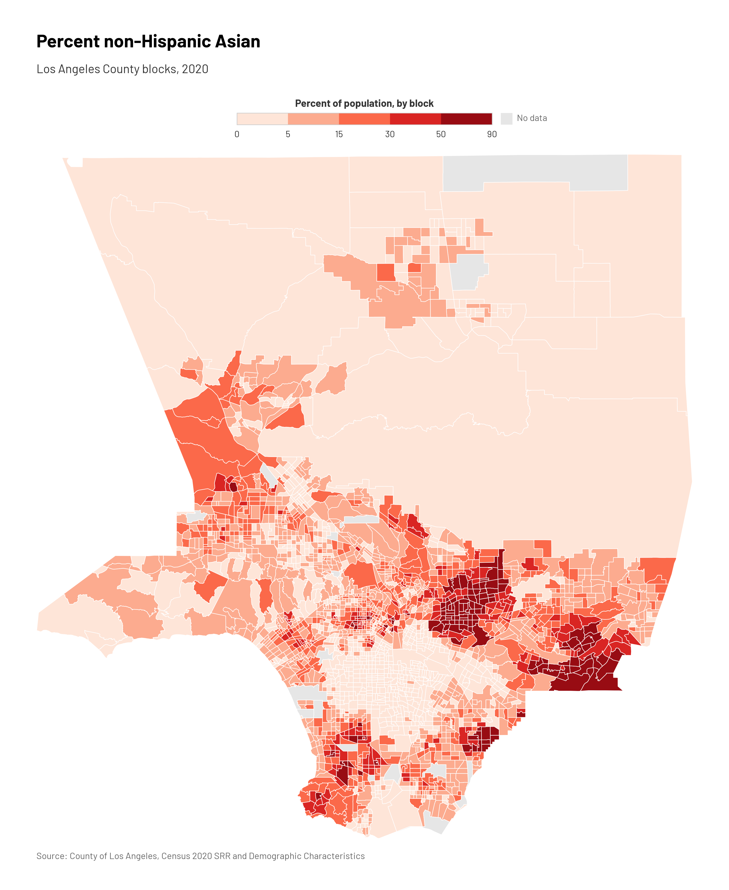
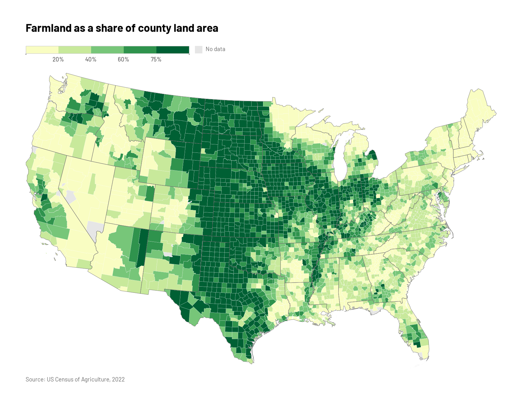
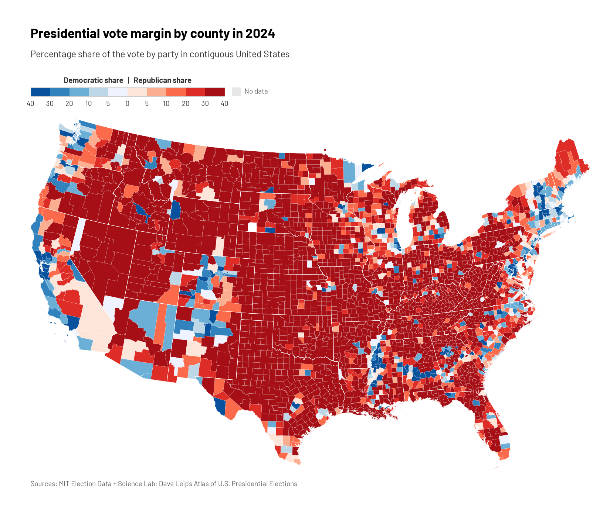
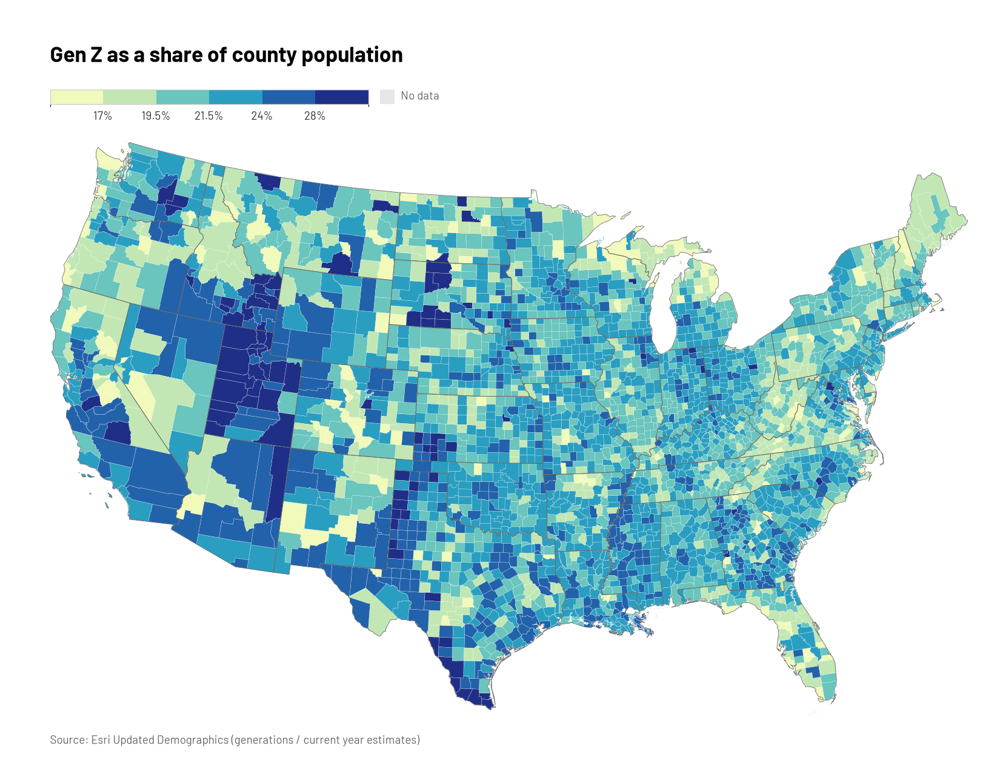

# Chorokit

A Python helper that creates clean choropleth maps with defaults for projection, layout, legend and other key configurations.

*This project is in the early stages of development. Contributions and feedback welcome.*

## Core principles

- **Easy to use:** the common case works with one function call or CLI command
- **Defaults first, flexibility when needed:** well-designed defaults that you can override with small configs; explicit beats auto
- **Speed:** avoid unnecessary copies and Python loops; keep plotting fast for large GeoDataFrames
- **Clean, production ready outputs:** consistent spacing, legible labels, subtle legend; high DPI and exact canvas size
- **Predictable and reproducible:** deterministic classifications and colors when breaks are specified; versioned defaults
- **Accessible and readable:** offer color-vision-safe palettes and readable tick labels
- **Small surface area:** dataclasses capture configuration; CLI mirrors the Python API
- **Composable design:** separate modules for projection, legend and layout so parts can be swapped later

## Install

```bash
pip install chorokit
```

For development:
```bash
git clone https://github.com/mstiles/chorokit.git
cd chorokit
pip install -e ".[dev]"
```

## Usage

### Basic Python example

```python
import geopandas as gpd
from chorokit import plot_choropleth

gdf = gpd.read_file("data/states.geojson")
fig, ax = plot_choropleth(
    gdf=gdf,
    value="value_column",
    title="headline",
    subtitle="subhead",
    source="Source: dataset",
)
fig.savefig("out.png", dpi=300)
```

Figure height is derived from the map's aspect ratio and the text/legend bands, so spacing stays consistent across geographies. Pass `layout=LayoutConfig(width=10)` to set the width in inches.

### CLI example

```bash
chorokit data/states.geojson value_column --title "headline" --subtitle "subhead" --source "Source: dataset" -o out.png
```

### Auto classification with top legend and projection

```python
from chorokit import plot_choropleth, LegendConfig, LayoutConfig, Projection

legend = LegendConfig(
    kind="binned",
    title="value per 100k residents",
    location="top",
    scheme="quantiles",
    k=5,
)

layout = LayoutConfig(
    title="headline",
    subtitle="subhead",
    source="Source: dataset",
    projection=Projection.us_albers(),
    width=12,
)

fig, ax = plot_choropleth(gdf, value="value_column", cmap="Reds", legend=legend, layout=layout)
```

### Projection override

```python
# pass an EPSG code directly
fig, ax = plot_choropleth(gdf, value="value_column", projection=3857)

# or set in layout config
layout = LayoutConfig(projection="EPSG:3857")
fig, ax = plot_choropleth(gdf, value="value_column", layout=layout)
```

### CLI with classification and top legend

```bash
chorokit data.geojson value_column \
  --scheme quantiles -k 5 \
  --legend-location top --legend-title "value per 100k"
```

### ColorBrewer palettes

```bash
# 7-class Blues palette with natural breaks
chorokit us_states.geojson POPULATION --palette Blues:7 --scheme natural \
  --title "US State Population" --source "Source: U.S. Census Bureau"

# 5-class Reds palette with quantile breaks
chorokit data.geojson value --palette Reds:5 --scheme quantiles
```

### Python with ColorBrewer palettes

```python
from chorokit import plot_choropleth, LegendConfig

legend = LegendConfig(
    kind="binned",
    palette=("Reds", 5),
    scheme="quantiles",
    title="Population density",
)

fig, ax = plot_choropleth(gdf, value="density", legend=legend)
```

### Real-world example

```python
import geopandas as gpd
from chorokit import plot_choropleth, LegendConfig, LayoutConfig

gdf = gpd.read_file("demographics.geojson")

legend = LegendConfig(
    kind="binned",
    title="Percent of population, by block",
    breaks=[0, 5, 15, 30, 50, 90],
    labels=["0", "5", "15", "30", "50", "90"],
)

layout = LayoutConfig(
    title="Percent non-Hispanic Asian",
    subtitle="Los Angeles County blocks, 2020",
    source="Source: County of Los Angeles, Census 2020",
    width=10,
)

fig, ax = plot_choropleth(gdf, value="pc_nh_asn", cmap="Reds", legend=legend, layout=layout)
```



### Census of Agriculture (county overlays)

```bash
python examples/ag_census_maps.py
```

Joins tidy county CSVs to US boundaries (cached under `examples/data/raw/` on first
run) and draws three CONUS maps that use state-boundary overlays, log + nice-round
breaks, compact/`%` legend labels, a left-aligned legend and a No-data swatch.



### 2024 election margin

```bash
python examples/election_2024_margin.py
```

Uses the county GeoJSON from the sibling `presidential-elections` repo (or a
cached copy under `examples/data/raw/`). Diverging `RdBu_r` scale with fixed
symmetric breaks around zero.



### County demographics

```bash
python examples/county_demographics.py
python examples/county_demographics.py --only gen_z_share
```

Caches Esri updated-demographics counties from
`https://stilesdata.com/gis/usa_counties_demos_generations.geojson` and draws
Gen Z share, median household income and population density.



## Features

- **Layout**: figure height comes from the map aspect plus fixed-size title, legend and source bands, so spacing is identical for wide, tall or square geographies
- **Projection**: auto-projects geographic data. Local/regional extents use a suitable UTM zone; large CONUS extents use EPSG:5070. You can pass an explicit CRS via int, EPSG string or `pyproj.CRS`.
- **Legend**: top or bottom placement (always horizontal); left or center align; binned or continuous; auto breaks via `scheme` and `k`; optional log classification and nice-round edges; interval or boundary labels with compact `k`/`M`/`%` formatting; automatic No-data swatch
- **Overlays**: pass `Overlay` layers (state lines, etc.) drawn on top of the fill
- **ColorBrewer palettes**: access to ColorBrewer 2.0 sequential, diverging and qualitative color schemes with discrete class counts
- **Theme**: Barlow ships with the package for consistent typography; override via `LayoutConfig.theme`
- **CLI**: flags for projection, legend options and auto classification

## Development

```bash
pip install -e ".[dev]"
pytest                          # unit + image comparison tests
python tools/gallery.py         # contact sheet across the case matrix
```

Regenerate image baselines after intentional layout changes:

```bash
pytest tests/test_visual.py --mpl-generate-path=tests/baseline
```

## ColorBrewer attribution

ColorBrewer color specifications and designs were developed by Cynthia Brewer ([https://colorbrewer2.org/](https://colorbrewer2.org/)). Please see the [ColorBrewer Apache-Style license](https://github.com/axismaps/colorbrewer/blob/master/LICENCE.txt).

> Copyright 2002 Cynthia Brewer, Mark Harrower, and The Pennsylvania State University

## License

MIT
